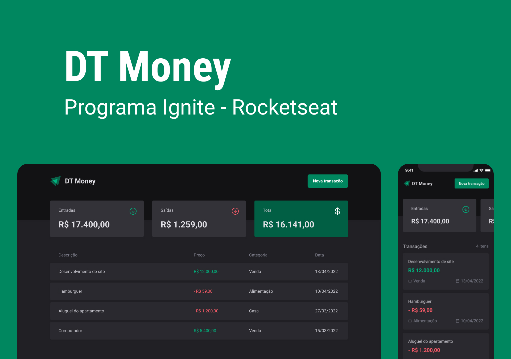

<h1 align="center"> DT MONEY </h1>

A plataforma para você ter uma visão completa sobre seu dinheiro.
 
Saiba mais acessando os links abaixo...

  <a href="#-tecnologias">Tecnologias</a>&nbsp;&nbsp;&nbsp;|&nbsp;&nbsp;&nbsp;
  <a href="#-layout">Layout</a>&nbsp;&nbsp;&nbsp;|&nbsp;&nbsp;&nbsp;
  <a href="#memo-licença">Licença</a>

  

 

  

## 🚀 Tecnologias

Esse projeto foi desenvolvido com as seguintes tecnologias:

- Vite
- Styled Components
- Typescript
- Context API
- React
- React Router Dom
- React Hook Form
- Validação de formulário com Zod

## 🔖 Layout

Você pode visualizar o layout do projeto através [DESSE LINK](https://www.figma.com/file/STiOVF0V4d4hzhjI9682D2/Coffee-Delivery-Copy?fuid=977602703130743767). É necessário ter conta no [Figma](https://figma.com) para acessá-lo.

## :memo: Licença

Esse projeto está sob a licença MIT.

---

Feito com 💙 by [Salinas](https://www.instagram.com/_eosalinas)
